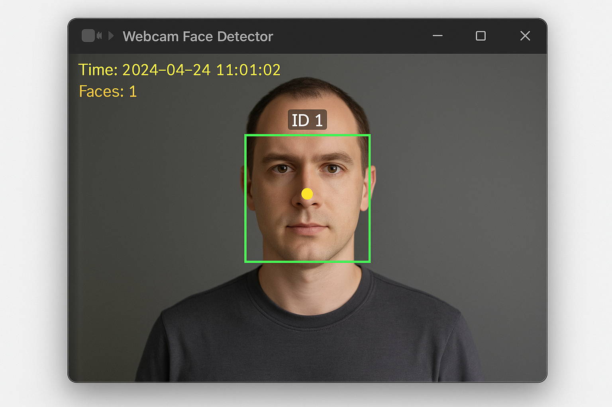

# 🎥 Face Detector with Audio & TTS Alerts

A Python-based face detection system using OpenCV, with real-time webcam support, beep alerts, and voice announcements using TTS (Text-to-Speech).

## ✅ Features
- Real-time face detection via webcam
- Audio beep alert (`beep.wav`)
- TTS voice alert ("Face detected at HH:MM:SS")
- Cooldown to avoid spamming
- Detects only new faces using centroid tracking

## 📸 Preview


## 🧰 Requirements
- Python 3.7+
- Packages in `requirements.txt`

## 🚀 Installation

```bash
git clone https://github.com/your-username/face-detector.git
cd face-detector
pip install -r requirements.txt
python main.py
```

> Make sure `beep.wav` is in the same folder as `main.py`.

## 📄 License
MIT License © 2025 DozKooki
